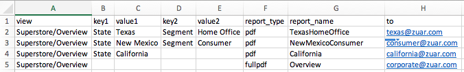

# Tableau Export

`Tableau Export` allows one to specify one or more
Tableau reports to be exported using `tabcmd`.  The specification for each report, which
can be thought of as a row in a spreadsheet or a database, defines the contents and
format of the report to be exported as well as the email address(es) of the
recipient(s).

`Tableau Export` is controlled by a JSON configuration that is passed in on the command line or
provided via the Mitto user interface.  The JSON configuration contains a basic
configuration for the application as well as a configuration for the reports
specifications.

# Configuration

There are three configuration sections for the job: `email`, `smtp`, and `tabcmd`.

The `email` section defines the source from which one or more *report specifications*
will be obtained.  A report specification defines a single report that is to be
created using Tableau's `tabcmd export`.  The report specification also includes one or
more recipients to whom the report will be emailed.

The `smtp` section defines the Mail Transfer Agent (MTA) that will be used to deliver
the email containing the report created by a report specification.

The `tabcmd` section defines parameters that will be used with `tabcmd export` when
creating a report.

The following is an example of a simple configuration for the job:

```json
{
	"email": {
		"type": "csv",
		"source": "/var/mitto/data/report-specifications.csv"
	},
    "smtp": {
        "server": "localhost",
        "port": "0",
        "require_tls": "false"
    },
    "tabcmd": {
        "server": "https://tableau.zuar.com",
        "user": "username",
        "password": "userpass",
        "no_certcheck": "true"
    }
}
```

# Section: `email`

The email section defines where report specifications come from.  The section can be in
one of three formats.

## `"type": "csv"`

```
{
	"email": {
		"type": "csv",
		"source": "/var/mitto/data/report-specifications.csv"
	},
    ...
}
```

This means that the report specifications will be found in a CSV file whose
location is specified by `source`.  See the "Report Specification" section for a
description of the CSV file and its contents.

## `"type": "sql"`

```
{
    "email": {
        "type": "sql",
        "dbo: "postgresql://localhost/analytics",
        "query": "...see below..."
    },
    ...
}
```

This means that the report specifications will be obtained by running the specified SQL
query. `query` is a SQL query on a single line, enclosed in double quotes.  The query
must return column names that exactly match those described in the "Report
Specification" section.

Due to formatting constraints, the value for `"query"` above is shown below on multiple
lines; in the actual configuration, it would be a single line.

~~~

	SELECT
	UNION ALL
	SELECT
	FROM

    asdf
	ddddd

~~~


```
SELECT 'view', 'key1', 'value1', 'key2', 'value2', 'report_type', 'to'
UNION ALL
SELECT view, key1, value1, key2, value2, report_type, to
FROM ... ;
```

## `"type": "json"`
   
```json
{
	"email": {
		"type": "json",
		"reports": [
			{"to": "ke@east.fm"
			},
			{"subject": "Daily CEO Report",
			 "to": "ke@east.fm",
			 "report_type": "fullpdf"
			},
			{"view": "Superstore/Product",
			 "subject": "Daily Home Office / Office Supplies Report",
			 "to": "ke@east.fm",
			 "filter": "Category=Office Supplies&Segment=Home Office"
			 "report_type": "pdf"
			},
			{"view": "Superstore/Overview",
			 "subject": "Daily Texas Data CSV",
			 "to": "ke@east.fm,KHEAustin@gmail.com",
			 "filter": "State=Texas",
			 "report_type": "csv"
			}
		]
	},
	...
}
```

This provides a report specification via JSON.  `"reports"` is a list containing one or
more dictionaries of report specifications.  Dictionary keys must exactly match the
column names described in the "Report Specification" section.

# The Report Specification

A report specification defines the contents of a report as well as its recipients.
Report specifications are provided to `Tableau Export` in one three ways: a path to a
CSV file, a SQL query, or a JSON string.  Regardless of how the specifications are
provided, they contain the same information.

Some attributes of a specification are mandatory, but most are optional.

For ease of discussion, this section assumes that report specifications are being
provided by a CSV file (i.e., a spreadsheet).  Each row in the file provides the
specification for one report to be created and emailed.  Each column in the file
represents an attribute of report.

An example of a CSV file containing four report specifications follows:



Row 1 contains the column headings. These headings must be present and they must be
spelled and capitalized exactly as shown. Each heading is the name of an attribute of a
report specification.

Each of rows two through five contain the attributes that specify a single report.

## Attributes of a Report Specification (i.e., "Columns") 

### `view` (mandatory)

A string containing the Tableau view to use when creating the report. Views may contain
spaces.

For example, if a filtered workbook view has the URL
```
https://tableau.zuar.com/#/views/Superstore/Overview?
```
its `view` in a report specification would be `Superstore/Overview`.

### Filter `key:value` Pairs (optional)

Tableau uses `filters` to precisely define the data to be included in a report.  A
filter comprises one or more `key:value` pairs; if data in the workbook matches a filter,
the data is included in the report.

A report specification can contain an arbitrary number of `key:value` pairs, with each
key and each value having a column.  Column headings for `key:value` pairs are of the
form `keyN` and `valueN`, where `N` is replaced with one or more numeric digits.  The
value of `N` is used to associate a key with its corresponding value.

For example, if a filtered workbook view has the URL
```
https://tableau.zuar.com/#/views/Superstore/Overview?State=Texas&Segment=Home Office
```
the `key:value` pairs for its filter would be:

| `n` | `key`   | `value`     |
| --- | -----   | -------     |
|  1  | State   | Texas       |
|  2  | Segment | Home Office |

These correspond to row `2`, columns `B:C` and `D:E` in the CSV example above.

### `report_type` (optional)

One of the following strings: `pdf | csv | png | fullpdf`.

If the attribute is not provided by the report specification, it will use the default
from the `tabcmd` section.

### `report_name` (optional)

This is the name given to the exported report when it is attached to the email.  When
the recipient saves the attachment, it will be saved using this name.  Do **not**
provide an extension (e.g., use `ceo_report` instead of `ceo_report.pdf`; the correct
extension will be provided by `Tableau Export`.

If the attribute is not provided by the report specification, it will use the default
from the `tabcmd` section.

### `to` (mandatory)

A string containing one or more comma-separated email addresses.  The report will be
emailed to the address(es).

Example: `alice@foo.com, bob@foo.com,ted@bar.com`

### `body` (optional)

String containing HTML which will be used as the body of the email.

Example: `<html><head>CEO Report</head><body>Report attached.</body></head></html>`

If the attribute is not provided by the report specification, it will use the default
from the `tabcmd` section.

### `bcc`, `cc` (optional)

Same as `to`.

### `from` (optional)

A string containing a single email address.  This address will appear in the `From:` field of
the outgoing email.

If the attribute is not provided by the report specification, it will use the default
from the `tabcmd` section.

### `height`, `width` (optional)

Only valid if `report_type` is `png`.  The height and width, in pixels, of the exported image.

If the attribute is not provided by the report specification, it will use the default
from the `tabcmd` section.

### `subject` (optional)

A string used as the subject of the outgoing mail.

If the attribute is not provided by the report specification, it will use the default
from the `tabcmd` section.

# Section `smtp`

The `smtp` configuration at the beginning of this document is the one to use if you wish
to send mail using the postfix server on the Mitto instance.  If you wish to send email
using a different SMTP server, you will likely need to provide all of the information
shown in the `smtp` section.  `"require_tls": "true"` directs the client to use
START_TLS to establish a secure connection.  If `require_tls` is used, `port` should be
the standard non-TLS port of the SMTP server -- do not use the standard TLS port.

The following are all of the SMTP options:
```
{
    "smtp": {
        "server": null,
        "port": null,
        "require_tls": null,
		"username": null,
		"password": null
    },
	...
}
```	

# Section `tabcmd`

These are all of the configurable options for `tabcmd`:
```
{
	"tabcmd": {
        "password": null,
		"server": null,
		"user": null,

	    "cmdpath": null,
		"no_certcheck": null,
		"proxy": null,
		"retries": null,
		"site": null,
		"timeout": null,

	    "body": null,
		"from": null,
		"height": null,
		"pagelayout": null,
		"pagesize": null,
		"report_name": null,
		"report_type": null,
		"subject": null,
		"width": null
	},
	...
}
```		

The first three options (`password`, `server`, and `user`) are mandatory.

`cmdpath` is optional and specifies a non-default `tabcmd` to use for the job.

`no_certcheck`, `proxy`, and `site` have the meanings shown on the `tabcmd` man page.
Although optional, you will likely need to use `"no_certcheck": "true"`.  `site` is
mandatory; the other two are optional.

`tabcmd` sometimes fails due to a lack of resources.  At other times, it may run for
longer than desired lengths of time.  The `timeout` parameter is the number of seconds
that `tabcmd` will be allowed to run before the system kills it.  The default is 30
seconds.  The `retries` parameter is the number of times that a failed `tabcmd` will be
retried before moving on to the next report specification.  These are useful on a
heavily loaded system.  They are all optional

`body`, `from`, `height`, `pagelayout`, `pagesize`,
`report_name`, `report_type`, `subject`, and `width` are all optional and can be
used to provide defaults for report specifications.
